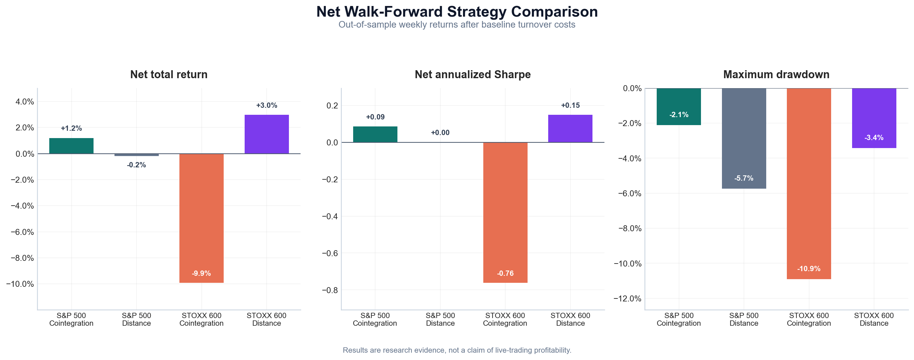
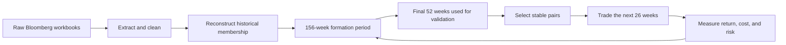
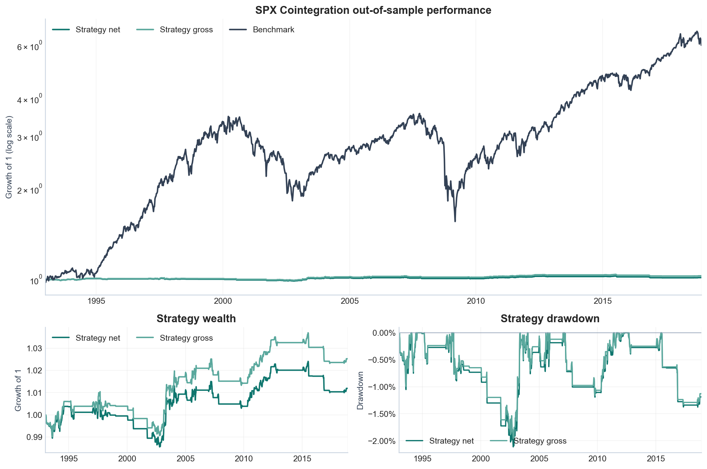
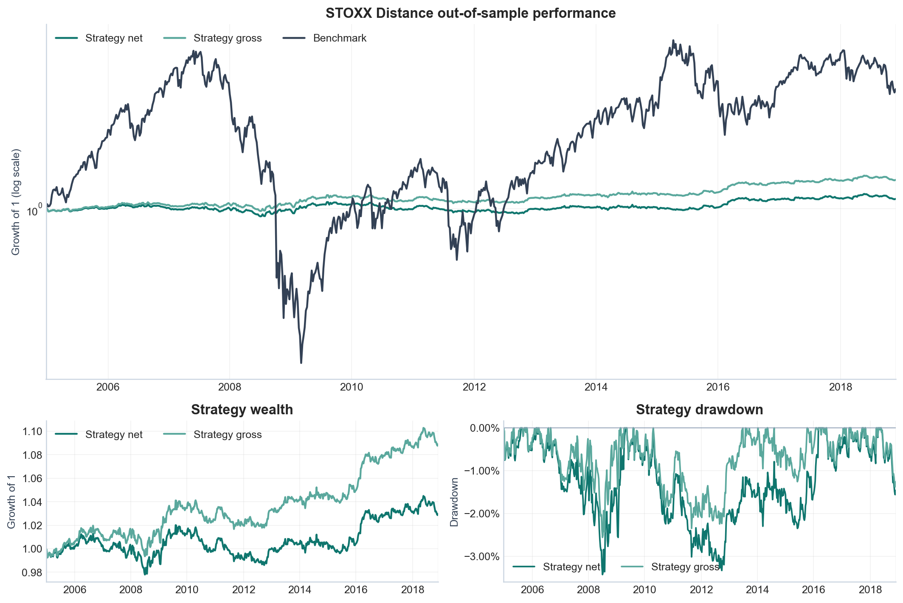

<div align="center">

# Walk-Forward Pairs Trading on the S&P 500 and STOXX 600

<p><strong>An honest, reproducible study of market-neutral statistical arbitrage across U.S. and European equities.</strong></p>

<p>
  
  
  
  
  
</p>

<p>
  <a href="https://github.com/linshenhao"></a>
  <a href="https://www.linkedin.com/in/linshenhao-49b127393"></a>
</p>

<p><strong>English</strong> | <a href="README.zh-CN.md">简体中文</a></p>

</div>

---

This project studies pairs trading in the **S&P 500** and **STOXX 600** universes. It starts from historical constituents, prices, sectors, and index weights, then compares two pair-selection methods in a strict walk-forward backtest:

- **Robust cointegration selection**
- **Stable-distance selection**

The objective is not to produce the most attractive historical equity curve. It is to answer a harder and more useful question:

> After controlling survivorship bias, statistical false discoveries, transaction costs, and the separation between model fitting and future trading, does pairs trading still provide a repeatable and economically useful edge?

The main conclusion is cautious: **the improved models reduce market exposure and drawdown, but returns remain weak and sensitive to costs and market regimes. The strategies are useful research baselines and may have a diversification role, but they are not ready for live deployment.**

> This repository is for research and education. It is not investment advice.

<p align="center">
  
</p>

<p align="center"><em>Figure 1. Net walk-forward results after baseline transaction costs. Low market exposure does not automatically imply a strong economic return.</em></p>

---

## Contents

- [1. Project in one minute](#1-project-in-one-minute)
- [2. Research objectives](#2-research-objectives)
- [3. Data](#3-data)
- [4. Financial concepts for beginners](#4-financial-concepts-for-beginners)
- [5. Why the original strategy performed poorly](#5-why-the-original-strategy-performed-poorly)
- [6. Complete research workflow](#6-complete-research-workflow)
- [7. Pair-selection methods](#7-pair-selection-methods)
- [8. Trading and portfolio rules](#8-trading-and-portfolio-rules)
- [9. Results and interpretation](#9-results-and-interpretation)
- [10. Can parameter changes improve the result?](#10-can-parameter-changes-improve-the-result)
- [11. Is the method practical?](#11-is-the-method-practical)
- [12. Model-development roadmap](#12-model-development-roadmap)
- [13. Repository structure](#13-repository-structure)
- [14. Reproducing the project](#14-reproducing-the-project)
- [15. Data publication and licensing](#15-data-publication-and-licensing)
- [16. Publishing this project to GitHub](#16-publishing-this-project-to-github)
- [17. References](#17-references)

---

## 1. Project in one minute

Suppose two economically similar companies have maintained a relatively stable price relationship. If the two stocks temporarily diverge, a pairs strategy can:

- buy the relatively cheap stock;
- short the relatively expensive stock;
- wait for the historical relationship to recover;
- close both positions and earn the relative-price convergence.

The strategy is concerned with the relationship between two securities rather than the direction of the whole market. It therefore aims to be **market neutral**.

This project does not restrict the universe to companies that remain in the index today. It reconstructs historical index membership from point-in-time weights. At each rebalance, the model uses only past data to select pairs, freezes all estimated parameters, and trades the following 26 weeks.



---

## 2. Research objectives

The project addresses the following questions:

1. Why did the original S&P 500 pairs strategy lose money?
2. Can correlation and cointegration identify relationships that remain stable in the future?
3. Does testing thousands of pairs create large numbers of accidental statistical discoveries?
4. Do an internal validation period, stability filters, and safer entry rules improve the result?
5. Does the same pair-selection method work in both the U.S. and European markets?
6. How much of the gross return is consumed by transaction costs?
7. Are better parameter results genuine improvements or backtest overfitting?
8. Is the current strategy realistic enough for live trading?

The research follows four principles:

- **Reproducibility:** code, parameters, results, and charts can be regenerated;
- **Out-of-sample testing:** each trading window uses only information available before it begins;
- **Interpretability:** every filter and trading rule has an explicit purpose;
- **Honest evaluation:** weak and negative results are retained instead of hidden by retrospective tuning.

---

## 3. Data

The project uses Bloomberg workbooks provided for the course:

| Universe | Securities with history | Daily sample | First trading window |
|---|---:|---|---|
| S&P 500 | 1,355 | 1990-01 to 2018-11 | 1993-01 |
| STOXX 600 | 1,255 | 2002-01 to 2018-11 | 2004-12 |

The workbooks contain:

- daily stock closing prices;
- historical index weights;
- sector classifications;
- company names;
- benchmark index levels;
- Bloomberg exchange codes for STOXX securities.

### Why historical membership matters

Using only companies that remain in an index today removes firms that failed, were acquired, or were delisted. This makes historical strategies look better than they really were. The problem is called **survivorship bias**.

This project reconstructs membership from the latest monthly index-weight snapshot available at each date. A security is considered an index member only when its weight is positive.

### Data extraction

The original `.xlsm` files are large. `pairs_trading/extract.py` streams the workbook XML and writes compact Parquet and CSV caches. The extraction step performs:

- Excel-date conversion;
- daily, monthly, and weekly dataset creation;
- Friday-close resampling;
- historical weight cleaning;
- repair of the misaligned S&P sector flags;
- extraction of STOXX sectors and exchange codes.

Local source files and caches live in:

```text
data/raw/
data/cache/
```

Both directories are listed in `.gitignore` and are not included in a normal `git add .`.

---

## 4. Financial concepts for beginners

### 4.1 Long and short positions

- **Long:** buy a stock and profit if its price rises;
- **Short:** borrow and sell a stock, then buy it back later and profit if its price falls.

Pairs trading combines a long leg and a short leg. It tries to earn a relative-price change rather than a broad market move.

### 4.2 Market neutrality

When the market rises, the long leg may gain while the short leg loses. When the market falls, the opposite may happen. Sizing both legs carefully can reduce sensitivity to the overall market.

Market neutral does not mean risk free. The pair can continue diverging, both securities can become difficult to trade, and the historical relationship can disappear.

### 4.3 Returns and log prices

A simple return is:

$$
return_t = \frac{price_t}{price_(t-1) - 1}
$$

The project estimates pair relationships using log prices:

$$
log(y_t) = \alpha + \beta \cdot log(x_t) + spread_t
$$

where:

- `y` and `x` are two stocks;
- `α` is the intercept;
- `β` is the hedge ratio;
- `spread` is the relative-price deviation after adjusting for the hedge ratio.

### 4.4 Correlation and cointegration

**Correlation** measures whether two returns tend to move in the same direction over short intervals. Two stocks can be highly correlated while their price levels continue drifting apart.

**Cointegration** is stronger. It asks whether a linear combination of two non-stationary price series is stationary. This is closer to the long-run relationship required by a mean-reversion trade.

In this project:

- correlation is a fast candidate pre-filter;
- cointegration is one possible relationship test;
- historical cointegration is never treated as a guarantee of future convergence.

### 4.5 Spread and hedge ratio

The spread is:

$$
spread_t = log(y_t) - \alpha - \beta \cdot log(x_t)
$$

The hedge ratio `β` determines the size of the short leg relative to the long leg. The strategy therefore does not simply trade one share against one share.

### 4.6 Mean reversion and the z-score

**Mean reversion** means that a spread may move back toward its historical average after a temporary deviation.

The z-score expresses the deviation in standard-deviation units:

$$
z_t = \frac{(spread_t - spread_{\mu})}{spread_{\sigma}}
$$

For example, `z = 2` means the spread is two historical standard deviations above its estimated mean.

### 4.7 Half-life

The **half-life** estimates how many weeks are required for half of a spread deviation to disappear.

- A very long half-life may not converge within the trading window;
- A very short half-life may be noise or a data artifact;
- The project accepts half-lives between 1 and 26 weeks.

### 4.8 P-values, q-values, and multiple testing

A p-value describes the statistical significance of one test. If thousands of candidate pairs are tested, small p-values will appear by chance even when no true relationships exist.

The project applies the Benjamini-Hochberg false-discovery-rate procedure. It converts the family of p-values into q-values and reduces the probability of selecting accidental discoveries from a large candidate set.

### 4.9 In-sample, out-of-sample, and walk-forward testing

- **In-sample:** data used to fit models or choose parameters;
- **Out-of-sample:** unseen data used only for evaluation;
- **Walk-forward:** repeatedly fit on past data, freeze the model, and test the next future period.

Walk-forward evaluation does not remove every form of overfitting, but it is more credible than tuning once on the complete historical sample.

### 4.10 Performance metrics

- **Total return:** cumulative return over the full test;
- **CAGR:** compound annual growth rate;
- **Volatility:** variability of returns;
- **Sharpe ratio:** average return per unit of volatility; this project follows the assignment convention of a zero risk-free rate;
- **Sortino ratio:** average return relative to downside volatility;
- **Maximum drawdown:** the largest decline from a previous equity peak;
- **Market beta:** sensitivity to benchmark movements;
- **Transaction cost:** the cost of opening, adjusting, and closing positions.

---

## 5. Why the original strategy performed poorly

The original S&P 500 notebook produced approximately:

- net total return: **-7.23%**;
- net Sharpe: **-0.18**;
- maximum drawdown: **-13.55%**.

The main problems were not limited to one entry parameter:

1. **Bidirectional test bias:** testing Engle-Granger in both directions and taking the smaller p-value increases the false-positive rate;
2. **No multiple-testing control:** selecting the smallest values from thousands of tests favors accidental relationships;
3. **No independent stability check:** a pair can look good over the full formation period even if it has already broken down near the end;
4. **Unsafe extreme entry:** the old logic could open a position after the spread had already crossed the stop threshold;
5. **Cost erosion:** frequent turnover consumed weak gross performance;
6. **Relationship failure:** corporate events, crises, and changing industry structure can permanently break historical relationships.

The revised design therefore focuses on rejecting bad relationships and preventing invalid trades, rather than searching for the most profitable historical threshold.

---

## 6. Complete research workflow

### Step 1: Extract and clean the data

Convert the large Excel workbooks to Parquet and CSV, standardize dates and labels, and create weekly Friday-close series.

### Step 2: Reconstruct the historical universe

At each formation date, read the latest historical index-weight snapshot and retain only securities with positive weights.

### Step 3: Filter untradable histories

A security must have:

- complete formation-period prices;
- a price above the minimum threshold;
- no weekly return beyond the data-quality threshold;
- sector and market-group labels;
- membership in the index at that time.

### Step 4: Create walk-forward windows

| Stage | Length | Purpose |
|---|---:|---|
| Formation | 156 weeks | Estimate the relationship |
| Internal validation | Final 52 formation weeks | Check whether the relationship remains stable |
| Trading | Next 26 weeks | Fully out-of-sample trading |

For cointegration selection, the first 104 formation weeks are used for the initial search. The final 52 weeks are a validation segment. Accepted pairs are then refit on the complete 156-week formation period before trading.

### Step 5: Generate candidate pairs

- Both securities must share a sector;
- STOXX candidates must also share a Bloomberg exchange code;
- Weekly-return correlation must exceed the minimum threshold;
- Candidates then enter the cointegration or distance procedure.

### Step 6: Validate relationship stability

The filters check:

- validation-period mean drift;
- validation-period volatility expansion;
- at least one validation mean crossing;
- extreme validation z-scores;
- a half-life between 1 and 26 weeks.

### Step 7: Select the final portfolio

- Select at most 20 pairs;
- Do not reuse one stock in multiple pairs within the same window;
- Leave unused pair slots in cash;
- Freeze every estimated parameter before the trading window begins.

### Step 8: Trade the next 26 weeks

Use the frozen spread mean, standard deviation, and hedge ratio to compute z-scores and apply entry, exit, stop, and timeout rules.

### Step 9: Calculate portfolio returns

Each pair receives at most `1 / 20` of portfolio capital. Pair returns are summed, divided by 20, and reduced by transaction costs.

### Step 10: Save research artifacts

Each market-method run writes:

- `weekly_returns.csv`: weekly net, gross, and benchmark returns;
- `metrics.csv`: performance and risk metrics;
- `selected_pairs.csv`: selected pairs and formation diagnostics;
- `equity_curve.png`: a GitHub-ready result chart.

---

## 7. Pair-selection methods

### 7.1 Robust cointegration

The robust cointegration model is the preferred S&P 500 specification:

1. Pre-filter by sector and weekly-return correlation;
2. Run Engle-Granger in both regression directions;
3. Correct for the two directions;
4. Apply Benjamini-Hochberg FDR control within each candidate family;
5. Reject validation drift, volatility expansion, and absent mean crossings;
6. Refit `alpha`, `beta`, the spread mean, and spread volatility on the full formation period;
7. Rank stable pairs while preventing duplicate stock usage.

The method is statistically stricter, but it can reject most candidates and leave substantial capital in cash.

### 7.2 Stable distance

The stable-distance model is the preferred STOXX 600 specification:

1. Normalize the two training log-price paths to a common starting point;
2. Calculate the mean squared distance between the normalized paths;
3. Treat a smaller distance as a closer historical relationship;
4. Estimate an OLS hedge ratio;
5. Apply the same validation stability and half-life filters;
6. Rank by distance and stability.

Distance selection avoids choosing pairs only because they have the smallest p-values. However, similar historical paths still do not guarantee future mean reversion.

### 7.3 Why the final method differs by market

No method works uniformly across both universes:

- robust cointegration performs better than distance selection in the S&P sample;
- stable distance performs substantially better than cointegration in the STOXX sample.

The difference may reflect market structure, sector composition, exchange and currency effects, and sample length. It is evidence against assuming that one universal pair-selection method can be copied across markets.

---

## 8. Trading and portfolio rules

| Parameter | Baseline | Meaning |
|---|---:|---|
| Formation | 156 weeks | Relationship-estimation period |
| Validation | 52 weeks | Internal stability check |
| Trading | 26 weeks | Out-of-sample window |
| Entry | `|z| >= 2.0` | Open a position |
| Exit | `|z| <= 0.5` | Mean-reversion exit |
| Stop | `|z| >= 3.5` | Stop loss |
| Maximum holding | 12 weeks | Timeout exit |
| Maximum pairs | 20 | Portfolio capacity |
| Transaction cost | 10 bps | Cost per unit of turnover |

Rules:

- `z <= -2`: buy the spread, long `y` and short beta-adjusted `x`;
- `z >= +2`: short the spread;
- `|z| <= 0.5`: close after convergence;
- `|z| >= 3.5`: stop the trade and lock the pair for the rest of that six-month window;
- holding period reaches 12 weeks: close the trade;
- if the observed spread is already beyond the stop boundary, do not open a new position.

---

## 9. Results and interpretation

All reported strategy results are weekly, use a zero risk-free rate, and are net of the baseline transaction cost.

| Market | Method | Total return | CAGR | Annual volatility | Sharpe | Max drawdown | Market beta |
|---|---|---:|---:|---:|---:|---:|---:|
| S&P 500 | **Robust cointegration** | **+1.19%** | +0.05% | 0.55% | **0.09** | **-2.12%** | -0.002 |
| S&P 500 | Stable distance | -0.18% | -0.01% | 1.24% | 0.00 | -5.73% | 0.008 |
| S&P 500 | Buy and hold | +498.62% | +7.12% | 16.41% | 0.50 | -56.24% | 1.000 |
| STOXX 600 | Robust cointegration | -9.92% | -0.74% | 0.97% | -0.76 | -10.91% | 0.006 |
| STOXX 600 | **Stable distance** | **+2.96%** | +0.21% | 1.48% | **0.15** | **-3.43%** | 0.008 |
| STOXX 600 | Buy and hold | +42.28% | +2.55% | 18.29% | 0.23 | -60.15% | 1.000 |

### S&P 500 interpretation

Robust cointegration improves the original negative result and sharply reduces drawdown. However:

- only 145 pair instances are selected across 52 six-month windows;
- the average is 2.8 pairs per window;
- 14 windows contain no eligible pairs;
- only about 39% of weeks contain strategy return or cost activity;
- gross total return is approximately +2.52%, versus +1.19% net;
- the first half earns about +1.11%, while the second half earns only +0.08%.

The low risk therefore comes partly from strict rejection and cash holdings, not from consistently accurate mean-reversion forecasts.

<p align="center">
  
</p>

<p align="center"><em>Figure 2. S&P 500 robust-cointegration strategy: benchmark comparison, gross-versus-net wealth, and drawdown.</em></p>

### STOXX 600 interpretation

Stable distance is the strongest strategy result in the project, but the economic return remains small:

- all 20 pair slots are filled in each of 28 windows;
- the strategy is active almost every week;
- gross total return is approximately +8.89%, versus +2.96% net;
- costs consume roughly two thirds of the gross gain;
- the first half loses about 0.62%, while the second half earns about 3.60%.

The strategy has much lower beta and drawdown than the index, which may provide diversification value. It does not replace a long-term equity investment.

<p align="center">
  
</p>

<p align="center"><em>Figure 3. STOXX 600 stable-distance strategy: benchmark comparison, gross-versus-net wealth, and drawdown.</em></p>

### Interpreting the benchmark comparison

The benchmark is a long-only equity investment. Pairs trading is a low-beta long-short strategy. The two approaches carry different risks, so a lower cumulative return does not automatically make pairs trading useless.

Nevertheless, the current strategy Sharpe ratios and CAGRs remain too low to clearly compensate for borrow, financing, execution, and model-failure risk.

---

## 10. Can parameter changes improve the result?

They can improve a historical backtest, but that does not prove better future performance.

The following sensitivity check holds the historically selected pairs fixed and changes one trading assumption at a time:

| Market | Scenario | Total return | Sharpe | Max drawdown |
|---|---|---:|---:|---:|
| S&P | Baseline entry 2.0 | +1.19% | 0.09 | -2.12% |
| S&P | Entry 1.5 | +5.26% | 0.28 | -2.27% |
| S&P | Entry 2.5 | +0.27% | 0.03 | -2.49% |
| S&P | Cost 20 bps | -0.13% | -0.01 | -2.27% |
| STOXX | Baseline entry 2.0 | +2.96% | 0.15 | -3.43% |
| STOXX | Entry 1.5 | +8.42% | 0.34 | -2.69% |
| STOXX | Entry 2.5 | -0.34% | -0.02 | -3.85% |
| STOXX | Cost 20 bps | -2.65% | -0.12 | -5.20% |

An entry threshold of 1.5 improves both historical samples. However, this result was discovered after examining the full evaluation period. Calling it the new optimal parameter would introduce **backtest overfitting**.

A credible parameter study should use nested walk-forward evaluation:

1. Define a small parameter grid in advance;
2. Compare parameters only inside each formation period;
3. Freeze the selected parameter;
4. Evaluate it once in the next 26-week window;
5. Aggregate only windows that were not used for parameter selection.

The preferred parameter should lie in a stable region where nearby values also perform reasonably, rather than being one isolated historical optimum.

---

## 11. Is the method practical?

### As an academic research project: yes

The project includes:

- historical membership and reduced survivorship bias;
- walk-forward out-of-sample evaluation;
- an internal validation segment;
- multiple-testing control;
- explicit trading rules;
- transaction costs;
- parallel S&P and STOXX experiments;
- reusable code, tests, result files, and charts.

### As a diversification strategy: possibly

Both preferred strategies have market betas close to zero and much smaller drawdowns than their long-only indices. The STOXX distance model may justify further research as a small relative-value allocation within a larger portfolio.

### As a live automated strategy: not yet

Important limitations remain:

- the data end in 2018 and do not establish a current edge;
- methods and parameters have been compared on the complete historical evaluation period;
- bid-ask spread and market impact are incomplete;
- short-borrow fees and availability are omitted;
- dividends, financing, margin, and collateral yield are incomplete;
- a Friday-close signal may not be executable at the same close;
- STOXX exchange code is only a currency proxy;
- sector labels are not strictly point-in-time;
- corporate actions, mergers, delistings, and stale prices can create false relationships.

The defensible conclusion is:

> The project shows that stricter filtering and validation reduce bad trades and produce low-market-exposure portfolios. It does not show that the current models provide stable and executable live alpha.

---

## 12. Model-development roadmap

### Priority 1: Freeze the baseline and obtain new data

- Preserve the current specification as a fixed baseline;
- Obtain post-2018 point-in-time constituents and prices;
- Write down the model rules before examining the new result;
- Use the new period as a genuinely untouched holdout.

### Priority 2: Add a trade-level ledger

The next version should record:

```text
market, window, pair, entry_date, exit_date, direction,
entry_z, exit_z, holding_weeks, exit_reason,
gross_return, transaction_cost, borrow_cost, net_return
```

This makes it possible to determine whether performance comes from a few extreme trades, which sectors fail most often, and where costs are generated.

### Priority 3: Model realistic execution

- Execute at the next tradable price;
- Include bid-ask spread, slippage, and market impact;
- Include borrow fees, availability, recall risk, and locate constraints;
- Include dividends, financing, margin, and collateral yield;
- Handle splits, mergers, delistings, and suspensions.

### Priority 4: Improve portfolio risk allocation

- Compare fixed allocation with volatility-scaled allocation;
- Limit sector, country, and single-stock exposure;
- Measure residual correlation across pairs;
- Prevent 20 apparently different pairs from loading on the same hidden factor.

### Priority 5: Test complexity only after the baseline

- Rolling or Kalman-filter hedge ratios;
- Market-volatility and liquidity regime filters;
- Industry-factor residual pairs;
- Machine learning only as a controlled extension of the simple baseline.

Every extension should have an ablation test. Complexity is justified only if it improves performance in genuinely unseen data.

---

## 13. Repository structure

```text
Pairs Trading Project/
├──> README.md                     # English project guide
├──> README.zh-CN.md               # Chinese project guide
├──> requirements.txt
├──> .gitignore
├──> pairs_trading/
│   ├──> __init__.py
│   ├──> backtest.py               # Pair selection and backtest engine
│   ├──> extract.py                # Excel extraction and cache creation
│   ├──> plots.py                  # Shared GitHub-ready chart style
│   └──> run.py                    # Command-line runner and result export
├──> notebooks/
│   ├──> SP500_Improved.ipynb
│   ├──> STOXX.ipynb
│   └──> legacy/
│       └──> SP500_Original.ipynb
├──> data/
│   ├──> raw/                      # Ignored: original licensed workbooks
│   └──> cache/                    # Ignored: generated Parquet/CSV caches
├──> results/
│   ├──> summary.csv
│   ├──> spx_cointegration/
│   ├──> spx_distance/
│   ├──> stoxx_cointegration/
│   └──> stoxx_distance/
├──> docs/
│   ├──> PROJECT_EXPLANATION_CN.md
│   ├──> reference/
│   └──> legacy/
└──> tests/
    └──> test_pairs_trading.py
```

Recommended entry points:

- `notebooks/SP500_Improved.ipynb`: complete S&P 500 study;
- `notebooks/STOXX.ipynb`: complete STOXX 600 study;
- `pairs_trading/backtest.py`: shared strategy implementation;
- `docs/PROJECT_EXPLANATION_CN.md`: detailed Chinese presentation guide;
- `results/summary.csv`: combined result summary.

---

## 14. Reproducing the project

### 14.1 Requirements

- Python 3.11 or a compatible version;
- macOS, Linux, or Windows;
- the original workbooks only when rebuilding the data caches.

### 14.2 Create the environment

```bash
cd "/Users/linshenhao/Desktop/Financial Market Analytics/Pairs Trading Project"

python3 -m venv .venv
source .venv/bin/activate
python -m pip install --upgrade pip
pip install -r requirements.txt
```

Windows PowerShell activation:

```powershell
.venv\Scripts\Activate.ps1
```

### 14.3 Place the licensed workbooks

Only if you have legitimate access, place the files at:

```text
data/raw/SPX500 Original.xlsm
data/raw/Stoxx 600 Originale.xlsm
```

### 14.4 Extract the data

```bash
python -m pairs_trading.extract --market all
```

Single-market alternatives:

```bash
python -m pairs_trading.extract --market spx
python -m pairs_trading.extract --market stoxx
```

### 14.5 Run the full backtest

```bash
python -m pairs_trading.run --market all --method both
```

The cointegration scan is the slowest step. Outputs are written to `results/`.

### 14.6 Run the tests

```bash
python -m unittest discover -s tests -v
```

### 14.7 Open the notebooks

```bash
jupyter lab
```

The notebooks default to:

```python
RECOMPUTE = False
```

This loads the saved deterministic results. Set it to `True` to rerun selection and trading from the local cache.

Readers without the licensed Bloomberg files can still inspect the executed notebooks, result CSV files, and charts stored in the repository.

---

## 15. Data publication and licensing

### Recommended approach: do not upload raw data or caches

The local source files are approximately:

| File | Size | Upload? |
|---|---:|---|
| `SPX500 Original.xlsm` | 123 MB | No |
| `Stoxx 600 Originale.xlsm` | 85 MB | No |

Reasons:

1. Bloomberg or course-provided data may not permit public redistribution;
2. The S&P workbook exceeds GitHub's 100 MB hard limit for a normal Git object;
3. Parquet caches can be regenerated from authorized source data;
4. Large binary files make the repository slow to clone and maintain.

The existing `.gitignore` contains:

```gitignore
data/raw/
data/cache/
```

The recommended public repository includes:

- Python source code;
- executed notebooks;
- this README and original explanatory writing;
- summary results, pair selections, and weekly returns;
- generated result charts;
- tests.

Before making the repository public, separately confirm whether the assignment PDF in `docs/reference/` and binary files in `docs/legacy/` may be redistributed. If uncertain, keep the repository private or exclude those files.

### Verify that data are ignored

After initializing Git, run:

```bash
git check-ignore -v data/raw/*
git check-ignore -v data/cache/*
```

The files should be listed as ignored. Do not bypass the rule with:

```bash
git add -f data/raw
git add -f data/cache
```

### If you have explicit redistribution permission

Only then should you consider Git LFS. Normal Git rejects individual files larger than 100 MB. Git LFS also has storage and bandwidth quotas, so it remains a poor choice for reproducible caches.

Official documentation:

- [GitHub repository limits](https://docs.github.com/en/repositories/creating-and-managing-repositories/repository-limits)
- [About large files on GitHub](https://docs.github.com/en/repositories/working-with-files/managing-large-files/about-large-files-on-github)
- [Ignoring files](https://docs.github.com/en/get-started/git-basics/ignoring-files)

---

## 16. References

- Engle, R. F., & Granger, C. W. J. (1987). *Co-integration and error correction: Representation, estimation, and testing*.
- Gatev, E., Goetzmann, W. N., & Rouwenhorst, K. G. (2006). *Pairs trading: Performance of a relative-value arbitrage rule*.
- Do, B., & Faff, R. (2010). *Does simple pairs trading still work?*
- Vidyamurthy, G. (2004). *Pairs Trading: Quantitative Methods and Analysis*.

---

## Final takeaway

The value of this project is not a claim of guaranteed profitability. It is a more credible quantitative research process:

- historical membership reduces survivorship bias;
- walk-forward windows prevent direct use of future information;
- validation and FDR controls reduce unstable or accidental relationships;
- U.S. and European universes test whether results generalize;
- transaction costs reveal how much gross performance survives implementation;
- negative and weak outcomes remain visible;
- the current version provides a reproducible baseline for future research.

Robust cointegration mainly improves the S&P result by refusing unstable trades. Stable distance provides some low-beta diversification value in STOXX, but costs consume most of its gross edge. The next important step is not more optimization on the old sample. It is a frozen-model test on newer, untouched data with realistic execution.

## Authors

| Author | Links |
|---|---|
| **Shen Hao Stefano Lin** | <a href="https://github.com/linshenhao"></a> <a href="https://www.linkedin.com/in/linshenhao-49b127393"></a> |
| **Li Hao** | Co-author |

---

<div align="center">

<p><strong>Built as a reproducible deep-learning study of human action recognition on HMDB51.</strong></p>

<p><a href="https://github.com/linshenhao/hmdb51-action-recognition">View the repository</a> · <a href="PROJECT_EXPLANATION.md">Read the detailed walkthrough</a></p>

</div>

